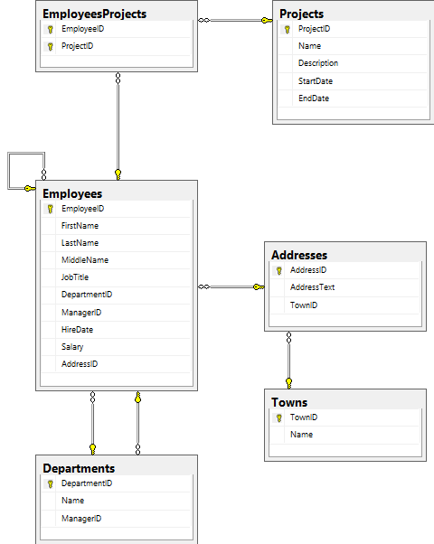

######1. What is SQL? What is DML? What is DDL? Recite the most important SQL commands.
- `SQL` is a special-purpose programming language designed for managing data held in a relational database management system (RDBMS), or for stream processing in a relational data stream management system (RDSMS).
Originally based upon relational algebra and tuple relational calculus, SQL consists of a data definition language, data manipulation language, and a data control language. The scope of SQL includes data insert, query, update and delete, schema creation and modification, and data access control. Although SQL is often described as, and to a great extent is, a declarative language (4GL), it also includes procedural elements.

- `DML` is a family of syntax elements similar to a computer programming language used for selecting, inserting, deleting and updating data in a database. Performing read-only queries of data is sometimes also considered a component of DML.
A popular data manipulation language is that of Structured Query Language (SQL), which is used to retrieve and manipulate data in a relational database. Other forms of DML are those used by IMS/DLI, CODASYL databases, such as IDMS and others.


- `DDL` is a syntax similar to a computer programming language for defining data structures, especially database schemas.
The data definition language concept and name was first introduced in relation to the Codasyl database model, where the schema of the database was written in a language syntax describing the records, fields, and sets of the user data model. Later it was used to refer to a subset of Structured Query Language (SQL) for creating tables and constraints. SQL-92 introduced a schema manipulation language and schema information tables to query schemas. These information tables were specified as SQL/Schemata in SQL:2003. The term DDL is also used in a generic sense to refer to any formal language for describing data or information structures.

######2. What is Transact-SQL (T-SQL)?
`Transact-SQL` (T-SQL) is Microsoft's and Sybase's proprietary extension to SQL. SQL, the acronym for Structured Query Language, is a standardized computer language that was originally developed by IBM for querying, altering and defining relational databases, using declarative statements. T-SQL expands on the SQL standard to include procedural programming, local variables, various support functions for string processing, date processing, mathematics, etc. and changes to the DELETE and UPDATE statements. These additional features make Transact-SQL Turing complete.[citation needed]

######3. Start SQL Management Studio and connect to the database TelerikAcademy. Examine the major tables in the "TelerikAcademy" database.


######4. Write a SQL query to find all information about all departments (use "TelerikAcademy" database).

```sql
USE TelerikAcademy

SELECT *
FROM Departments
```

######5. Write a SQL query to find all department names.

```sql
USE TelerikAcademy

SELECT Name AS 'Department Name'
FROM Departments
```

######6. Write a SQL query to find the salary of each employee.

```sql
USE TelerikAcademy

SELECT FirstName AS 'First Name', LastName AS 'Last Name', Salary
FROM Employees
```

######7. Write a SQL to find the full name of each employee.

```sql
USE TelerikAcademy

SELECT FirstName + ' ' + LastName AS 'Employee Full Name'
FROM Employees
```

######8. Write a SQL query to find the email addresses of each employee (by his first and last name). Consider that the mail domain is `telerik.com`. Emails should look like `John.Doe@telerik.com`. The produced column should be named "Full Email Addresses".

```sql
USE TelerikAcademy

SELECT FirstName + '.' + LastName + '@telerik.com' AS 'Full Email Addresses'
FROM Employees
```

######9. Write a SQL query to find all different employee salaries.

```sql
USE TelerikAcademy

SELECT DISTINCT Salary AS 'All different employee salaries'
FROM Employees
```

######10. Write a SQL query to find all information about the employees whose job title is “Sales Representative“.

```sql
USE TelerikAcademy

SELECT *
FROM Employees
WHERE JobTitle = 'Sales Representative'
```

######11. Write a SQL query to find the names of all employees whose first name starts with "SA".

```sql
USE TelerikAcademy

SELECT FirstName as 'First Name'
FROM Employees
WHERE FirstName LIKE 'SA%'
```

######12. Write a SQL query to find the names of all employees whose last name contains "ei".

```sql
USE TelerikAcademy

SELECT LastName as 'Last Name'
FROM Employees
WHERE LastName LIKE '%ei%'
```

######13. Write a SQL query to find the salary of all employees whose salary is in the range [20000…30000].

```sql
USE TelerikAcademy

SELECT
	FirstName + ' ' + LastName as 'Employee Name',
    Salary
FROM Employees
WHERE Salary BETWEEN 20000 AND 30000
```

######14. Write a SQL query to find the names of all employees whose salary is 25000, 14000, 12500 or 23600.

```sql
USE TelerikAcademy

SELECT
	FirstName + ' ' + LastName as 'Employee Name',
    Salary
FROM Employees
WHERE Salary IN (25000, 14000, 12500, 23600)
```

######15. Write a SQL query to find all employees that do not have manager.

```sql
USE TelerikAcademy

SELECT
	FirstName + ' ' + LastName as 'Employee Name',
    ManagerID
FROM Employees
WHERE ManagerID IS NULL

```

######16. Write a SQL query to find all employees that have salary more than 50000. Order them in decreasing order by salary.

```sql
USE TelerikAcademy

SELECT
	FirstName + ' ' + LastName as 'Employee Name',
	Salary
FROM Employees
WHERE Salary > 50000
ORDER BY Salary DESC
```

######17. Write a SQL query to find the top 5 best paid employees.

```sql
USE TelerikAcademy

SELECT TOP 5
	FirstName + ' ' + LastName as 'Employee Name',
    Salary
FROM Employees
ORDER BY Salary DESC
```

######18. Write a SQL query to find all employees along with their address. Use `INNER JOIN` with `ON` clause.

```sql
USE TelerikAcademy

SELECT
	e.FirstName + ' ' + e.LastName as 'Employee Name',
	a.AddressText as 'Adderss'
FROM Employees e
INNER JOIN Addresses a
ON e.AddressID = a.AddressID
```

######19. Write a SQL query to find all employees and their address. Use `Equijoins` (conditions in the `WHERE` clause).

```sql
USE TelerikAcademy

SELECT
	e.FirstName + ' ' + e.LastName as 'Employee Name',
	a.AddressText as 'Adderss'
FROM Employees e, Addresses a
WHERE e.AddressID = a.AddressID
```

######20. Write a SQL query to find all employees along with their manager.

```sql
USE TelerikAcademy

SELECT
	e.FirstName + ' ' + e.LastName as 'Employee Name',
	m.FirstName + ' ' + m.LastName as 'Manager Name'
FROM Employees e
LEFT OUTER JOIN Employees m
ON e.ManagerID = m.EmployeeID
```

######21. Write a SQL query to find all employees, along with their manager and their address. Join the 3 tables: `Employees e`, `Employees m` and `Addresses a`.

```sql
USE TelerikAcademy

SELECT
	e.FirstName + ' ' + e.LastName as 'Employee Name', 
	m.FirstName + ' ' + m.LastName as 'Manager Name',
	a.AddressText as 'Address'
FROM Employees e
LEFT OUTER JOIN Employees m
ON e.ManagerID = m.EmployeeID
JOIN Addresses a
ON e.AddressID = a.AddressID
```

######22. Write a SQL query to find all departments and all town names as a single list. Use `UNION`.

```sql
USE TelerikAcademy

SELECT Name
FROM Departments
UNION
SELECT Name
FROM Towns
```

######23. Write a SQL query to find all the employees and the manager for each of them along with the employees that do not have manager. Use `RIGHT OUTER JOIN`. Rewrite the query to use `LEFT OUTER JOIN`.

 - `RIGHT OUTER JOIN`

```sql
USE TelerikAcademy

SELECT
	e.FirstName + ' ' + e.LastName AS Employee,
	m.FirstName + ' ' + m.LastName AS Manager
FROM Employees e
RIGHT JOIN Employees m
ON e.ManagerID = m.EmployeeID
```

 - `LEFT OUTER JOIN`

```sql
USE TelerikAcademy

SELECT
	e.FirstName + ' ' + e.LastName AS Employee,
	m.FirstName + ' ' + m.LastName AS Manager
FROM Employees e
LEFT JOIN Employees m
ON e.ManagerID = m.EmployeeID
```

######24. Write a SQL query to find the names of all employees from the departments "Sales" and "Finance" whose hire year is between 1995 and 2005

```sql
USE TelerikAcademy

SELECT
	e.FirstName + ' ' + e.LastName AS Employee,
	e.HireDate,
	d.Name
FROM Employees e, Departments d
WHERE e.DepartmentID = d.DepartmentID 
AND d.Name IN ('Sales', 'Finance')
AND e.HireDate BETWEEN '1995-01-01 00:00:00' AND '2005-12-31 00:00:00'
```
